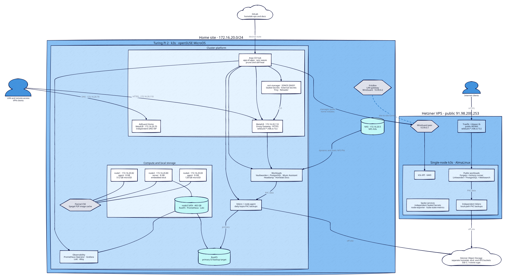
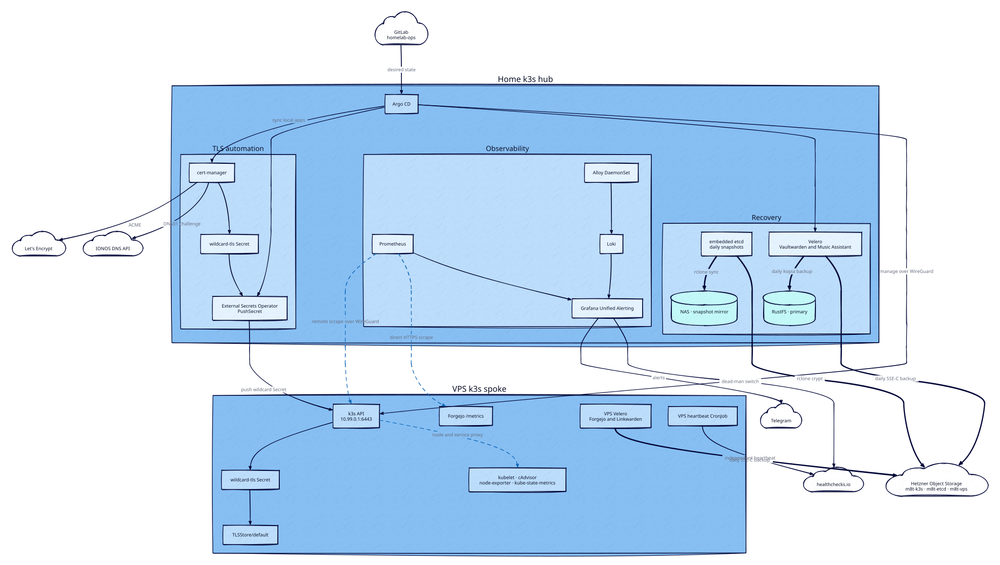

# homelab-ops

GitOps manifests and provisioning automation for a 3-node k3s cluster on a [Turing Pi 2](https://turingpi.com/product/turing-pi-2/) board. Raspberry Pi CM4 modules, ARM64, openSUSE MicroOS.

---

## Cluster

| Node  | IP | Role | RAM | Disk | Notes |
|-------|----|------|-----|------|-------|
| node1 | 172.16.20.82 | k3s agent  | 8 GB | 512 GB microSD | `m8t.io/storage=sd`, `m8t.io/image-cache=true` |
| node3 | 172.16.20.80 | k3s server | 8 GB | 7.3 GB eMMC + 465 GB SATA | embedded etcd, rustfs object storage, `m8t.io/image-cache=true` |
| node4 | 172.16.20.83 | k3s agent  | 8 GB | 128 GB microSD | `m8t.io/storage=sd`, `m8t.io/image-cache=true` |

node1 (previous k3s server, CM4 Lite) died 2026-07-03 (microSD wear-out, see the incident report in the docs wiki); node3 took over as server and reuses its `.80` IP. node1 rejoined 2026-07-05 as a plain agent on a new 512 GB microSD. node3's datastore was migrated from sqlite to embedded etcd (enables snapshot-based backups). node3's 465 GB SATA disk is mounted at `/var/lib/rustfs` and serves as the primary object storage backend. `m8t.io/storage=sd` marks nodes with reliable storage -- used to pin Velero node-agent and other storage-sensitive workloads. `m8t.io/image-cache=true` marks nodes that participate in the k3s embedded registry mesh -- currently all three cluster nodes (see Infrastructure).

**Network**

| Address | Service | Notes |
|---------|---------|-------|
| 172.16.20.110 | Envoy Gateway | MetalLB L2 VIP -- all HTTPS traffic enters here |
| 172.16.20.70  | AdGuard Home  | Dedicated LB IP, independent of the Gateway |
| 172.16.20.5   | NFS server    | Export `/k3s`, primary persistent storage |

All HTTPRoutes attach to a single Gateway; TLS terminates there via a shared wildcard cert (`*.m8t.io`, IONOS DNS01). AdGuard gets its own MetalLB IP so DNS is independent of the Gateway.

---

## Architecture

The home cluster is the GitOps and observability hub. The Hetzner VPS is a
managed spoke, but its public workloads remain available if the tunnel or home
cluster is unavailable.

### Runtime topology

[](architecture/runtime.svg)

The home cluster is not in the request path for Forgejo or Linkwarden. The
FritzBox permits the home side to initiate connections to the VPS; the VPS
cannot initiate a new connection into the home LAN.

### Control, telemetry, and recovery flows

[](architecture/operations.svg)

Solid arrows show request, control, or alert delivery. Dashed arrows show
Prometheus pull-based scraping; the arrow points from the scraper to the target.
Thick arrows show backup data movement.

The diagrams group Kubernetes add-ons instead of enumerating every Argo CD
Application. Exact component versions and operational procedures remain in the
tables below and in the runbook.

Editable D2 sources live beside the SVGs in `architecture/`. Regenerate them
with D2 0.7.1 or newer:

```bash
d2 architecture/runtime.d2 architecture/runtime.svg
d2 architecture/operations.d2 architecture/operations.svg
```

---

## Stack

**Infrastructure**

| Component | Technology | Notes |
|-----------|-----------|-------|
| OS | openSUSE MicroOS | Immutable root, transactional updates, automatic rollback |
| Kubernetes | k3s | Single binary, embedded containerd + Flannel CNI, embedded etcd datastore |
| Ingress | Envoy Gateway (Gateway API) | Single wildcard TLS cert shared across all HTTPRoutes |
| Load balancer | MetalLB (L2 mode) | |
| TLS | cert-manager + IONOS DNS01 | Wildcard `*.m8t.io` via Let's Encrypt |
| Storage | NFS (nfs-subdir-external-provisioner) | NAS at 172.16.20.5 |
| Object storage | rustfs | S3-compatible API on node3 SATA disk |
| Image cache | k3s embedded registry (Spegel) | P2P mirror across all three nodes; accelerates re-pulls and dodges slow upstream peering |

**Observability**

| Component | Technology | Notes |
|-----------|-----------|-------|
| Metrics | kube-prometheus-stack (Prometheus Operator) | 14d retention on node3, node-exporter + kube-state-metrics as sub-charts; scrape discovery via ServiceMonitor/PodMonitor CRs |
| Logs | Loki + Alloy | Loki SingleBinary on node3, Alloy DaemonSet ships pod logs + node journal (replaced deprecated Promtail) |
| Visualization | Grafana | Datasources for Prometheus + Loki, sidecar-provisioned dashboards and alert rules |
| Alerting | Grafana Unified Alerting | Alerts provisioned via ConfigMaps, delivered to Telegram; dead-man's switch heartbeat to healthchecks.io |

Six dashboards (provisioned via sidecar): Node Resources, Cluster Overview, Logs (Loki), Velero Backups, ArgoCD, Envoy Gateway. Alert rules cover node health, disk/memory/CPU thresholds, filesystem read-only and kernel storage errors, pod crash loops, service availability (Vaultwarden, Music Assistant, AdGuard), PVC capacity, cert expiry, Velero schedule misses, and ArgoCD sync drift.

**Operations**

| Component | Technology | Notes |
|-----------|-----------|-------|
| GitOps | ArgoCD | App-of-apps, automated sync with prune + self-heal; Source Hydrator (alpha) renders selected apps to a `hydrated` branch for manifest visibility |
| Secrets | Sealed Secrets | Keypair in `ansible/sealed-secrets/` (gitignored), sealed files safe to commit |
| Config reload | stakater/reloader | Watches Secrets/ConfigMaps, auto-restarts pods on changes |
| Backup | Velero + etcd snapshots | Daily kopia PVC backups to rustfs (primary) + Hetzner S3 (offsite, SSE-C); etcd snapshots mirrored to NAS + Hetzner (rclone crypt) |
| Security | Trivy Operator | Continuous vulnerability and config audit scanning, results as CRDs |
| Dependency updates | Renovate | Weekly CI cron; MRs for Helm charts and image tags in Application values, Telegram notification summary |

---

## Workloads

| App | Notes |
|-----|-------|
| Vaultwarden | Password manager, PostgreSQL backend, NFS PVC |
| Music Assistant | Music server, hostNetwork for mDNS/UPnP player discovery, static NFS PV for the FLAC library (RO) |
| AdGuard Home | Network DNS, query logging, blocklists |
| Headlamp | Kubernetes dashboard, plugins: Trivy vulnerability viewer, cert-manager |
| Homelab Docs | MkDocs Material site at `docs.m8t.io`; built locally, served via nginx + git-sync from main |

---

## Repo layout

```
provisioning/
  Makefile              full pipeline: ignition -> flash -> k3s -> addons
  butane/               per-node Butane configs (compiled to Ignition JSON)
  ansible/              bootstrap playbooks: Sealed Secrets + ArgoCD deploy

gitops/
  apps/                 25 ArgoCD Application manifests (app-of-apps root)
  dry/                  Hydrator dry sources (Kustomize + helmCharts, currently headlamp)
  infra/
    bootstrap/          ArgoCD + Sealed Secrets (HelmCharts, AppProjects, config)
    cluster/            Node labels, RBAC, storage class patches
    monitoring/         Grafana dashboards, alerts, secrets
    homelab/            Workload manifests (13 component dirs)
```

---

## Provisioning

Nodes boot via Ignition -- Butane YAML is compiled to JSON and embedded into raw MicroOS disk images, flashed to nodes over the Turing Pi BMC using `tpi`.

Boot sequence per node (~8-12 min, fully automated):
1. `growdisk.service` -- expands the partition to fill the disk, reboots
2. `firstboot-packages.service` -- installs required packages, reboots
3. `install-k3s-server.service` / `install-k3s-agent.service` -- joins the cluster

Once the server node is Ready, Ansible bootstraps the control plane in order:

> Sealed Secrets keypair → Sealed Secrets controller → ArgoCD → AppProjects → GitLab deploy secret → root Application

ArgoCD then syncs the rest from this repo via sync waves.

---

## GitOps / Sync waves

| Wave | Components |
|------|-----------|
| -2 | `argocd` (HelmChart, AppProjects, repo secret, Gateway HTTPRoute, TLS certificate), sealed-secrets |
| 0  | Envoy Gateway CRDs, MetalLB -- Helm chart + IPAddressPool + L2Advertisement |
| 1  | Envoy Gateway, cert-manager, NFS provisioner, k3s-upgrade (SUC + upgrade plans), cluster, reloader |
| 2  | IONOS webhook, rustfs |
| 3  | ClusterIssuer, Velero, etcd-offsite, Trivy Operator, workloads (vaultwarden, music-assistant, adguard, headlamp, docs) |
| 4  | kube-prometheus-stack (Prometheus Operator, node-exporter, kube-state-metrics) |
| 5  | Loki, Grafana (+ dashboards, alerts, secrets), Alloy |

All Applications sync with retry + backoff. Most workloads use multi-source Applications (Helm chart + git-tracked config in one app). Headlamp uses the Source Hydrator (alpha) -- dry source in `gitops/dry/headlamp/`, rendered manifests pushed to the `hydrated` branch. AppProject `homelab` enforces a source repo allowlist. Add new repos to `gitops/infra/bootstrap/argocd/appproject.yaml`.

---

## VPS spoke

A single-node k3s cluster on the Hetzner VPS (AlmaLinux), registered as a spoke in this ArgoCD (hub-and-spoke). Managed the same GitOps way from `gitops/vps/` -- `vps-root` app-of-apps, `vps` AppProject destination-locked to the VPS API. The homelab is the hub.

| Address | Role | Notes |
|---------|------|-------|
| `10.99.0.1` | VPS k3s API + `wg0` | WireGuard site-to-site tunnel IP (FritzBox <-> VPS), `--tls-san 10.99.0.1` |
| `91.98.200.253` | VPS public IP | Traefik LoadBalancer (klipper-lb), 80/443 ingress |

- **Tunnel is one-way for new connections.** The FritzBox masquerades the WireGuard tunnel, so only homelab -> VPS works (ArgoCD, ESO push); VPS -> homelab LAN is NAT-dropped.
- **TLS:** the `*.m8t.io` wildcard cert is pushed from the homelab to the VPS by ESO `PushSecret` (no cert-manager on the VPS). Traefik serves it via `TLSStore/default`.

**VPS workloads** (migrated off docker-compose, 2026-07-21):

| App | Delivery | Endpoint |
|-----|----------|----------|
| Linkwarden + PostgreSQL + Meilisearch | raw manifests + Meilisearch chart | `linkwarden.m8t.io` |
| Forgejo | Helm chart `17.1.3` (SQLite, rootless) | `forge.m8t.io` + SSH `91.98.200.253:2222` (klipper-lb) |
| Forgejo Actions runner | standalone Deployment + rootless `docker:dind` sidecar | in-cluster |

VPS app secrets use a **second** sealed-secrets controller with its own cert (`ansible/sealed-secrets/tls-vps.crt`), independent of the homelab -- so they stay tunnel-independent.

**Monitoring is remote-scrape -- no Prometheus on the VPS.** The homelab Prometheus pulls VPS metrics: infra targets (kubelet, cAdvisor, node-exporter, kube-state-metrics) through the kube-apiserver proxy at `10.99.0.1:6443` (pod/service IPs aren't routable over the tunnel), Forgejo `/metrics` directly over HTTPS with a token (the apiserver proxy can't carry the backend token). 60s interval, tagged `cluster=vps`. A Grafana `absent()` alert pages on the VPS falling off; a VPS-side healthchecks.io heartbeat CronJob covers total-VPS-down independent of the tunnel.

**Host firewalld setup (not in git -- rerun on a VPS rebuild):** AlmaLinux ships firewalld active. Without these, the WireGuard handshake, the API over the tunnel, and ingress->pod (`502`) all fail even though the cloud firewall is open.

```bash
firewall-cmd --permanent --add-port=51820/udp                     # WireGuard handshake
firewall-cmd --permanent --zone=trusted --add-interface=wg0       # k3s API (6443) over the tunnel
firewall-cmd --permanent --zone=trusted --add-source=10.42.0.0/16 # pod CIDR (else ingress->pod 502)
firewall-cmd --permanent --zone=trusted --add-source=10.43.0.0/16 # service CIDR
firewall-cmd --reload
```

---

## Secrets

All secrets are SealedSecrets -- encrypted with the cluster public key, safe to commit. Seal offline:

```bash
kubeseal --cert ansible/sealed-secrets/tls.crt -f secret.yaml -w sealedsecret.yaml
```

The keypair in `ansible/sealed-secrets/` is the only way to decrypt existing secrets if the cluster is lost. Back it up.

---

## Backup

Velero backs up the `vaultwarden` and `music-assistant` namespaces daily using kopia filesystem backup (captures actual PVC data, not just manifests).

| Location | Type | Schedule | Retention | Encryption |
|----------|------|----------|-----------|-----------|
| rustfs | In-cluster S3 | 02:00 daily | 30 days | None (trusted network) |
| Hetzner | Offsite S3 | 03:00 daily | 30 days | SSE-C (customer-managed key) |

The SSE-C key at `~/velero-sse-c.key` encrypts all Hetzner backups. Losing it means permanent loss of access to those backups -- keep an offline copy.

**etcd snapshots** (3-2-1): k3s writes a local snapshot on node3 daily at 00:00 (retention 12). At 00:30 two CronJobs in the `etcd-offsite` app mirror the snapshot dir via `rclone sync`:

| Target | Transport | Encryption |
|--------|-----------|-----------|
| NAS (`172.16.20.5:/k3s`) | In-pod NFS mount | None (trusted network) |
| Hetzner `m8t-etcd` bucket | rclone crypt remote | Client-side (contents encrypted, filenames readable) |

Both jobs run with `--max-delete=3` so an unexpectedly empty local snapshot dir fails the sync instead of mirroring the deletion. The rclone crypt password + salt live in Vaultwarden.

---

## AI-assisted

This project is built with significant assistance from [Claude Code](https://claude.ai/claude-code) (Anthropic). Provisioning scripts, Butane configs, Ansible playbooks, GitOps manifests, dashboards, alert rules, and documentation were authored collaboratively between a human operator and an AI coding assistant. All changes are reviewed and approved by the human before being committed.
